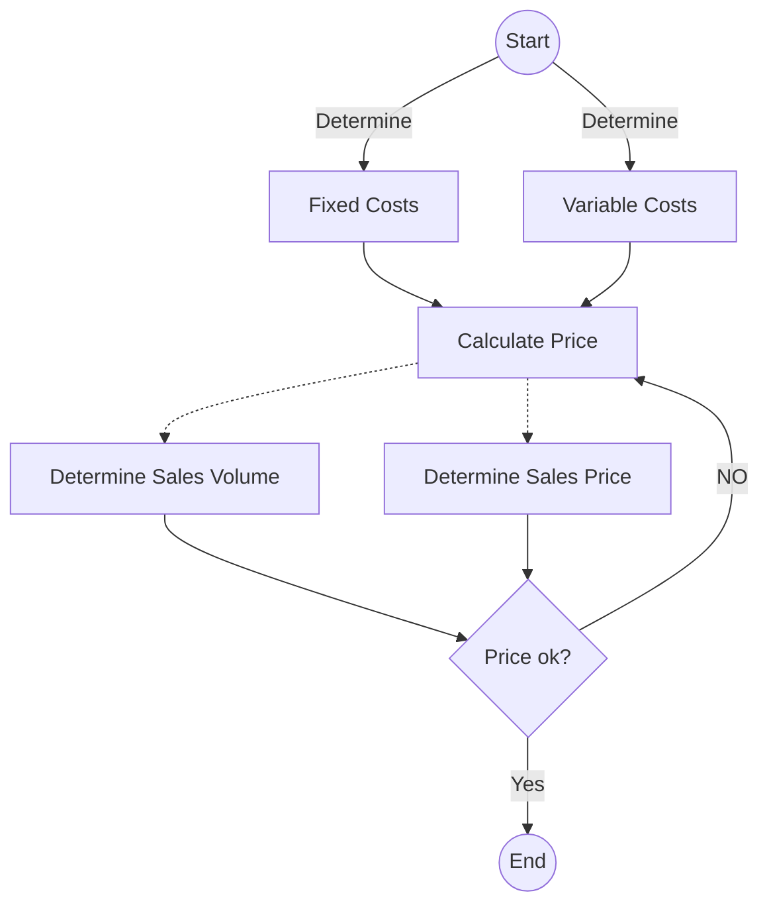
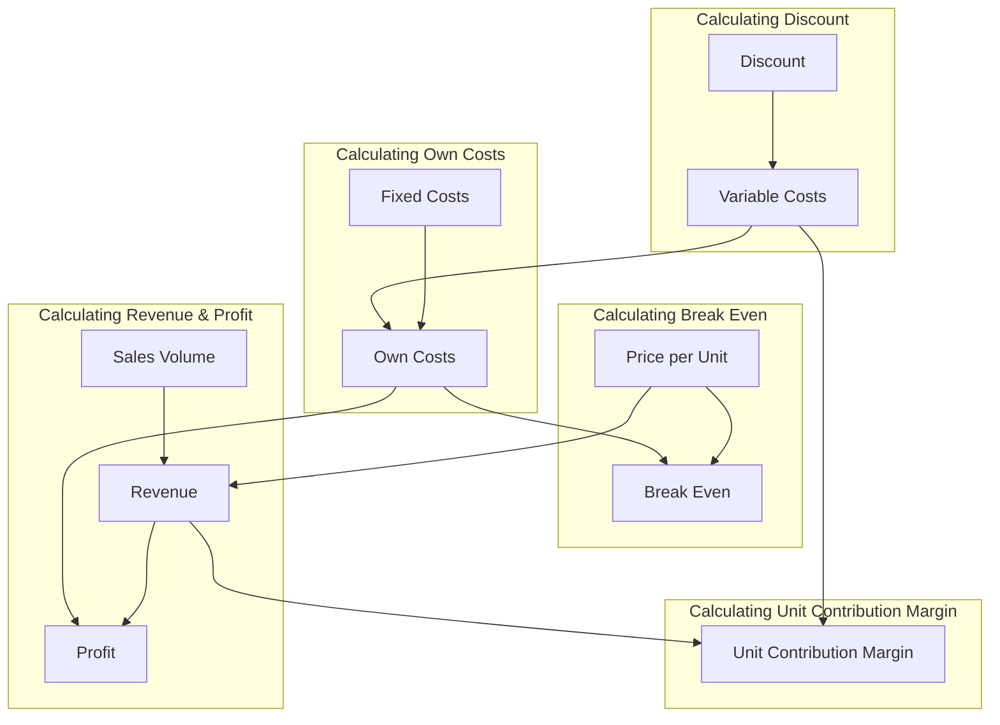

# Architecture

This will give an overview of the domain and how the application is structured.
{: .fs-6 .fw-300 }

## Workflow

```mermaid
flowchart TD
    ST((Start))
    ST-- Determine -->FC[Fixed Costs]
    ST-- Determine -->VC[Variable Costs]
    CP[Calculate Price]
    FC --> CP
    VC --> CP
    SV[Determine Sales Volume]
    SP[Determine Sales Price]
    CP .-> SV
    CP .-> SP
    DEC{Price ok?}

    SV --> DEC
    SP --> DEC
    END((End))
    DEC -- Yes --> END
    DEC -- NO --> CP
```

## Price Calculations

```mermaid
flowchart TD
subgraph Calculating Discount
        D[Discount] --> V[Variable Costs]
    end
    subgraph Calculating Own Costs
        F[Fixed Costs] & V --> OC[Own Costs]
    end
    subgraph Calculating Break Even
        PpU[Price per Unit]
        PpU & OC --> BE[Break Even]
    end
    subgraph Calculating Revenue & Profit
        SV[Sales Volume] & PpU --> R[Revenue]
        R & OC --> P[Profit]
    end
    subgraph Calculating Unit Contribution Margin
        R & V --> UCM[Unit Contribution Margin]
    end
```