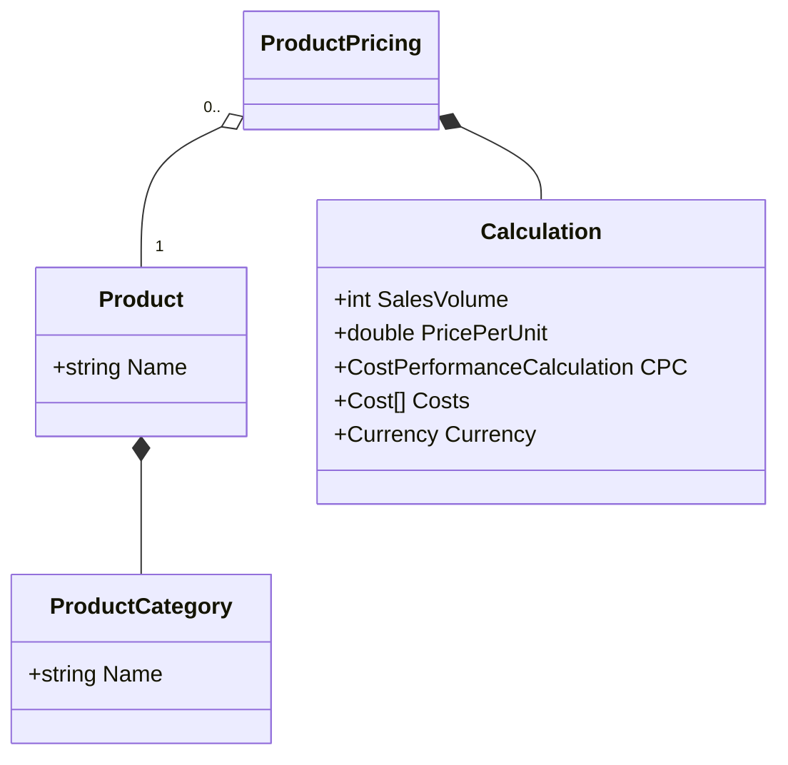

# Product Pricing

Combines a referenced product with a particular calculation.
{: .fs-6 .fw-300 }

## Content

* Reference for product
  * (until there is a product service to resolve the reference by)
    * Name of product 
    * Category of product
    * Distinguishable Feature (e.g. books could have page count)
* [Calculation](../entities/calculation.md) (Root of Aggregate)

