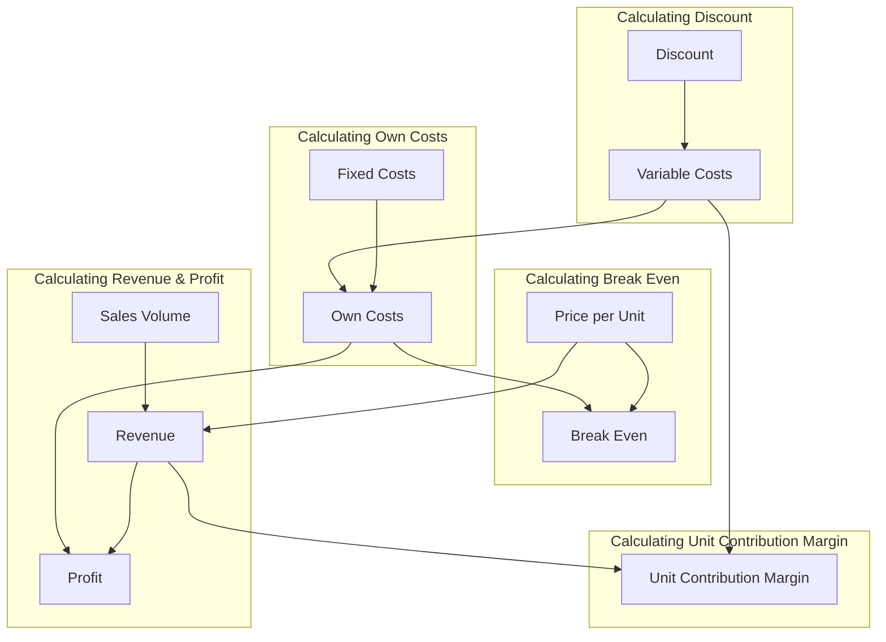

# Derived Values

We got a few basic terms. But based on costs, sales volume and price we can calculate some interesting values.
{: .fs-6 .fw-300 }

## Terminology

* **Total Costs:** Sum of fixed costs and variable costs multiplied by manufacturing volume.
* **Own Costs:** The costs of the product. This is the total costs divided by sales volume. These costs must be met otherwise we are at a loss.
* **Break Even:** The amount of units that needs to be sold at a given price to cover our total costs.
* **Revenue:** The amount of money earned before costs. Basically sales volume multiplied with price per unit.
* **Unit Contribution Margin:** Coverage of our variable costs with the earned revenue.
* **Profit:** Earnings after subtracting our total costs.

## Price Calculation: Derived Values

The following graphs show how the calculation will be done. This is not a big computation, so we can easily do that on the frontend part and dynamically update it when the user is entering those values.

