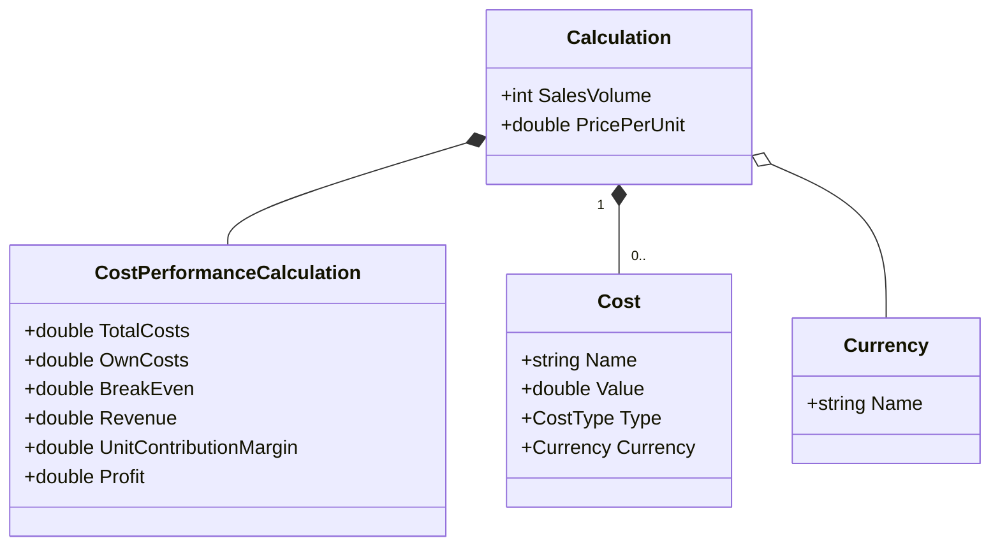

# Calculation

A calculation holds costs, a sales price and the cost performance calculation.
{: .fs-6 .fw-300 }

## Content

* Sales Volume
* Price per Unit
  * including [Currency](../value-objects/currency.md)
* [Costs](../value-objects/costs.md)
* [Cost Performance Calculation](../value-objects/cost-performance-calculation.md) (will be calculated and should only be read-only outside the entity)

