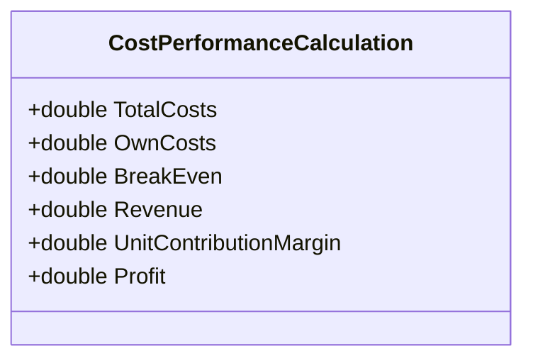

# Cost Performance Calculation

This performance calculation holds the [derived values](../derived-values.md) and allows to evaluate a pricing.
{: .fs-6 .fw-300 }

## Content

* Total Costs
* Own Costs
* Break Even
* Revenue
* Unit Contribution Margin
* Profit

