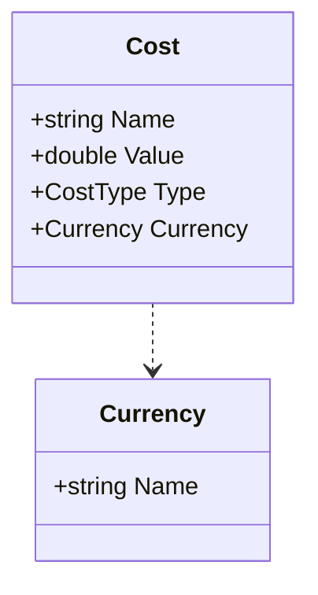

# Costs

Basically a value with a name. Thus hard to identify and tightly coupled to a calculation.
{: .fs-6 .fw-300 }

## Content

* Name of Cost
* Value of Cost
* Type (Fix, Variable, Discount)
* [Currency](./currency.md)

