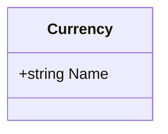

# Currency

A value is nothing without a currency to give it meaning.
{: .fs-6 .fw-300 }

## Content

* Name of the Currency
* maybe exchange rate

```mermaid
classDiagram
    class Currency {
        +string Name
    }
```