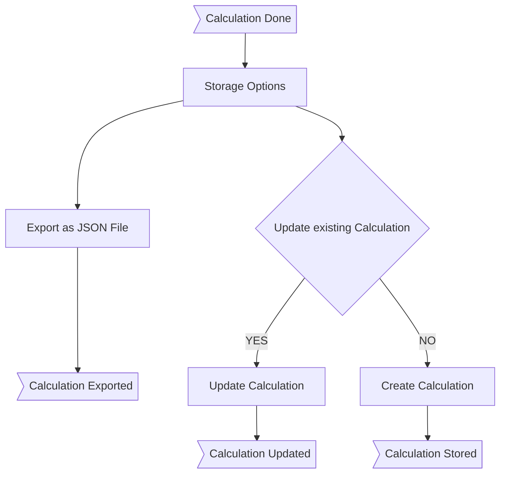

# Saving a Calculation

After calculating costs and setting a price, we might want to store this calculation in one way or another.
{: .fs-6 .fw-300 }

## Workflow: Saving a Calculation

There are two ways to save a calculation: Storing as a file or storing in the database.
Storing in a file was the old way before we designed a backend and persistance storage. The big improvement, using a backend for storing things is 

* If a user management is implemented: Having the ability to store *my* calculations to *my* profile
  * Necessary Information: Product-/Project-Name
* Analyzing price calculations to enhance the usage of the calculator (e.g. price predictions or recommendations, sales forecasts etc.). This feature should be opt-in.
  * Necessary Information
    * Product-/Project-Name
    * Category
    * Distinguishable Feature (e.g. books could have page count)

### Working with Calculations

It should be possible to work differently with Calculations. One could think of

* a) Have multiple Calculations per Product, so that you can compare them
* b) Update existing an Calculation, because there have to be changes and we don't want to leave orphans
* c) Delete a Calculation to clean up the mess
* d) Copy a Calculation to create a derivate of an existing one