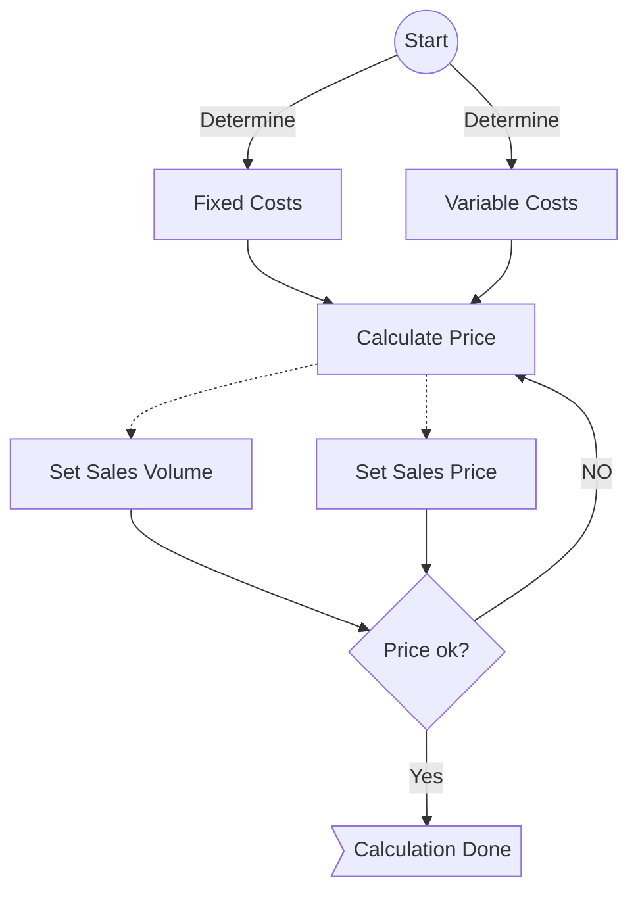

# Setting a Price

A user gets help from the calculator but in the end the user needs to set on a price.
{: .fs-6 .fw-300 }

## Workflow: Setting a Price

This workflow is handled on the frontend side. While some derived calculations (see [Derived Values](../derived-values.md)) can be done on the backend side, it would be a bigger overhead sending requests there and back again for some simple calculations.

